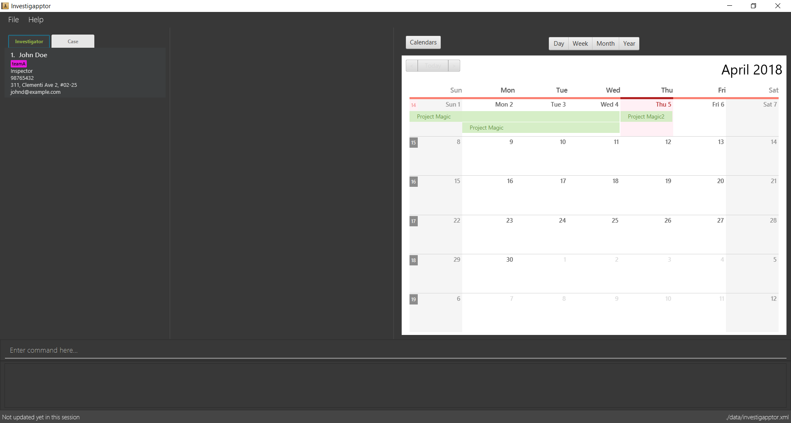

= Investigapptor
ifdef::env-github,env-browser[:relfileprefix: docs/]

https://travis-ci.org/CS2103JAN2018-F14-B3/main[image:https://travis-ci.org/CS2103JAN2018-F14-B3/main.svg?branch=master[Build Status]]
https://ci.appveyor.com/project/quentinkhoo/main/branch/master[image:https://ci.appveyor.com/api/projects/status/e3ayy1cn5eciu66n/branch/master?svg=true[Build status]]
https://coveralls.io/github/CS2103JAN2018-F14-B3/main?branch=master[image:https://coveralls.io/repos/github/CS2103JAN2018-F14-B3/main/badge.svg?branch=master[Coverage Status]]
image:https://api.codacy.com/project/badge/Grade/4da5f907a45940e1adc46a0086a52cb4["Codacy code quality", link="https://www.codacy.com/app/quentinkhoo/main?utm_source=github.com&utm_medium=referral&utm_content=CS2103JAN2018-F14-B3/main&utm_campaign=Badge_Grade"]
https://gitter.im/se-edu/Lobby[image:https://badges.gitter.im/se-edu/Lobby.svg[Gitter chat]]

Investigapptor is a one-stop solution for investigators to make managing cases as simple, straightforward, and efficient as possible.

ifdef::env-github[]

endif::[]

ifndef::env-github[]
image::images/Ui.png[width="600"]
endif::[]

== Why use Investigapptor?

Our primary goals are:

* Streamline the complex investigations process
* Maximise workflow efficiency through use of electronic input
* Eradicate risks associated with paper-based processing
* Offer a fuss-free and seamless user experience

== What can Investigapptor do?

* Overview of investigators and cases
* Assign investigators to cases
* Assess key information of a case
* Categorise cases and investigators with labels

Note that Investigapptor is a desktop application with a GUI,
but most of the user interactions happen using a CLI (Command Line Interface).

== Site Map

* <<UserGuide#, User Guide>>
* <<DeveloperGuide#, Developer Guide>>
* <<AboutUs#, About Us>>
* <<ContactUs#, Contact Us>>

== Acknowledgements

* Some parts of this sample application were inspired by the excellent http://code.makery.ch/library/javafx-8-tutorial/[Java FX tutorial] by
_Marco Jakob_.
* Libraries used: https://github.com/TomasMikula/EasyBind[EasyBind], https://github.com/TestFX/TestFX[TextFX], https://bitbucket.org/controlsfx/controlsfx/[ControlsFX], https://github.com/FasterXML/jackson[Jackson], https://github.com/google/guava[Guava], https://github.com/junit-team/junit4[JUnit4], https://github.com/dlemmermann/CalendarFX[CalendarFx]
* This code was modified from the https://github.com/se-edu/addressbook-level4[AddressBook-Level4 project], which was created by the https://github.com/se-edu/[SE-EDU] initiative

== Licence : link:LICENSE[MIT]
